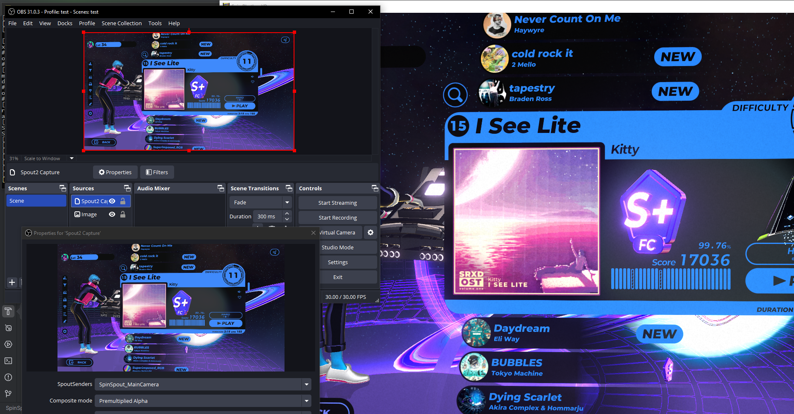

# SpinSpout
**Mod for Spin Rhythm XD that adds Spout2 output for direct game capture straight from shared memory in the GPU via a RenderTexture.**

This mod utilizes [KlakSpout](https://github.com/keijiro/KlakSpout) to send Spout2 data, which is automatically dropped into your `[Spin Rhythm root]\SpinRhythm_Data\Plugins\x86_64` folder the first time you launch the game with the mod installed.

Some code is lifted from the [KlakSpout project by keijiro](https://github.com/keijiro/KlakSpout) *(Unlicense)*, as well as the Beat Saber mod [ReeCamera by Reezonate](https://github.com/Reezonate/ReeCamera) *(MIT)*

Configuration is done via the added Mod Settings page.

> [!NOTE]
> I'm still working on a few things for this mod (like the ability to use more than 1 camera, user-defined camera offsets, etc.). Still very early in development, but mostly works as is right now!

> [!WARNING]
> This is untested in VR mode (this is next on my list)

## Dependencies
- SpinCore

## (you probably want this)
[obs-spout2-plugin](https://github.com/Off-World-Live/obs-spout2-plugin) -- Plugin for OBS to use Spout2 sinks as sources